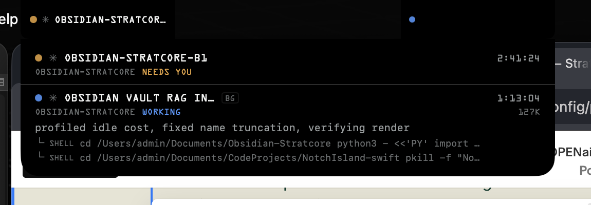

# StratIsland

A Dynamic Island for the Mac notch, showing the live state of Claude Code and Codex CLI
sessions. Hover to expand, click a session to jump to the cmux surface that owns it.



## What it shows

Each Claude Code session — interactive **and** background jobs, as peers — and each Codex
CLI session gets a pill. State is the only thing colour encodes; CLI identity is a glyph
(`✳` Claude, `◇` Codex).

| State | Colour | Meaning |
|---|---|---|
| `NEEDS YOU` | amber | blocked on a permission prompt or a question — *you* are the bottleneck |
| `DONE` | green | finished since you last looked |
| `WORKING` | blue | agent is running a turn |
| `IDLE` | grey | alive, waiting |
| `EXITED` | dim | gone; drops into **Recent** after a few seconds |

The left flank carries the single most urgent session; the right flank carries state dots
for the rest (`+N` past four). The expanded panel adds project, live action text, elapsed
time, token count, and any running subagents.

The status menu reports `Health: OK` or names any watcher/socket component that is degraded.
Runtime failures are also written through unified logging under subsystem
`com.stratcore.stratisland`.

## Requirements

- A Mac with a notch (the geometry is derived from `NSScreen.auxiliaryTop*Area`; on a
  machine without one the island simply never appears)
- macOS 14+, Swift 6 language mode
- [cmux](https://cmux.com) — the host it is built around; click-to-focus addresses a
  session by the surface id cmux exports into it. Terminal.app still works as a fallback
  for sessions started outside cmux, via its AppleScript `tty of tab`

## Install

```sh
./package.sh                     # builds build/StratIsland.app
./scripts/install-hooks.sh       # wires both CLIs into the app (backs up what it touches)
./scripts/install-launchagent.sh # optional: start at login
open build/StratIsland.app
```

No permission prompt is needed for cmux: its control socket accepts a request from any
process running as you, so the app talks to it directly. Clicking a session that was
started in **Terminal.app** instead falls back to AppleScript, which does ask for
**Automation** the first time.

## How it gets its data

**Claude Code** publishes a genuinely rich feed, and it is the primary source:

- `~/.claude/sessions/<pid>.json` — identity, `kind`, `status`
- `~/.claude/jobs/<jobId>/state.json` — `detail`, `fan[]`, `tokens`

Both are watched with FSEvents, so the app costs nothing while nothing is happening, and
it picks up sessions that were already running before it launched.

**Codex** publishes nothing comparable — its rollout logs are write-only with no status
field and no index. So Codex support is deliberately coarse: process presence for
existence, rollout file mtime for activity, and its `notify` hook for completion. Processes
are bound one-to-one to rollouts by working directory and kernel process start time; the
rollout session ID makes completion routing deterministic when several sessions share a
directory. Codex sessions carry no detail line. Deep rollout parsing would depend on an
undocumented format and is deliberately excluded.

**cmux** supplies the binding between a session and the place it is running. It exports
`CMUX_SURFACE_ID` (and `CMUX_WORKSPACE_ID`, `CMUX_AGENT_LAUNCH_KIND`) into every process it
launches, so the pid the watchers already hold is enough to address the pane — read once
per process out of `KERN_PROCARGS2`, with a walk up the parent chain for background jobs
the daemon owns. Focusing is then `cmux rpc surface.focus`, followed by `window.focus` on
the window the response names.

**Push hooks** cover what files cannot. A `Notification` hook is what makes `NEEDS YOU`
possible at all: in the session file, "waiting for your permission" and "finished" both
read as `idle`. Both hook scripts write one line of JSON to a Unix socket at
`~/Library/Application Support/StratIsland/push.sock`.

### The ntfy scripts are safe

`install-hooks.sh` replaces `~/.local/bin/{claude,codex}-ntfy-notify.py` (backing up the
originals). The ntfy.sh POST is unchanged and runs **first**; the socket write happens
after it, non-blocking, wrapped in its own bare `except`. A dead app, a stale socket, or a
bug in the emit can never cost you a phone notification. Verify any time with:

```sh
pkill -f StratIsland
rm -f ~/Library/Application\ Support/StratIsland/push.sock
echo '{"hook_event_name":"Stop"}' | python3 ~/.local/bin/claude-ntfy-notify.py; echo $?
```

## Design notes

- **Nothing is drawn inside the cutout.** It is a physical hole with no pixels. The island
  is two flanks in the menu bar plus a panel that drops below.
- **144 pt flanks, in both states.** OCR A is monospaced and wide; at 124 pt useful session
  titles still clipped around 10 characters. 144 pt fits ~12 characters and still leaves
  ~650 pt of menu bar
  free on each side — and menus grow from the left edge while status items grow from the right, so the
  strip beside the notch is the last real estate either claims.
- **Exactly two lines per session in the panel.** Identity and timing on the first,
  context on the second. A variable-height row made the list jump whenever a `detail`
  string appeared or a subagent spawned; `fan[]` is now a count, not a list.
- **One type dial.** `Theme.fontBump` is added to every size in the island, so overall
  legibility moves without disturbing the relative proportions.
- **The menu bar is detected, not inferred.** Visibility follows the window server's
  "Menubar" window: it drops off the on-screen window list exactly when the menu bar goes
  away. Looking instead for a layer-0 window covering the whole screen missed every
  full-screen app that leaves the menu-bar strip alone, and could not be loosened without
  also matching an ordinary zoomed window.
- **Session titles come from the transcript, not the session file.**
  `~/.claude/sessions/<pid>.json` has a `name`, but for interactive sessions it arrives
  with `nameSource: "derived"` and is just the working directory reworded — every thread
  started in one repo reads the same. Claude Code appends an `ai-title` record to
  `~/.claude/projects/<slug>/<sessionId>.jsonl` and keeps it current, so the last one is
  the thread's actual subject; `last-prompt` is the fallback before a title exists.
  Background jobs keep their own name, which is already model-written. Codex writes no
  title at all, so its first genuine user message stands in (skipping the injected
  AGENTS.md and `<environment_context>` messages, which also arrive as user turns).
- **Hover is pointer-driven, not event-driven.** SwiftUI's `.onHover` chattered against a
  window that resizes under the pointer — a single pass logged `inside=true, false, true,
  false` in a few hundred milliseconds, and whichever edge landed last won, which is why
  the panel sometimes stayed open. A global mouse-moved monitor and a rectangle test
  decide it instead. Expanding tests the collapsed rect and collapsing tests the expanded
  one, so the two boundaries can't fight.
- **The island never moves sideways.** Expanding used to widen each flank 108 → 150 pt, so
  the window's origin moved left while the SwiftUI content re-laid out on a different curve
  than the frame animation: the pill visibly slid as it opened. Flanks are a constant
  144 pt and hover changes height only.
- **A session is addressed, not searched for.** Terminal focusing had to match a
  `/dev/ttysNNN` path against every tab of every window over AppleScript, and background
  sessions have no tab at all. cmux hands each process its own surface id, so focusing is
  one RPC with an exact address — and because the control socket authorises by user rather
  than by an Automation grant (verified from a scrubbed `env -i` environment, which is
  what a LaunchAgent launch has), the permission prompt disappears with it.
- **Both hosts lift the visibility gate.** The island shows while cmux *or* Terminal.app is
  running, so a session started in either is never invisible; the same one-line override
  still keeps a blocked or just-finished session on screen regardless.
- **One process owns the island.** A non-blocking per-user file lock is acquired before
  AppKit starts. Finder, raw-binary, and LaunchAgent launches therefore cannot create
  overlapping windows; the kernel releases the lock automatically if the app crashes.
- **Menu-bar visibility is polled every 1.5 s** as well as observed. Nothing is posted when
  the menu bar auto-hides or is revealed, and space-change notifications arrive before the
  window list reflects the new space.

### Debugging

    STRATISLAND_DEBUG_LOG=1 ./build/StratIsland.app/Contents/MacOS/StratIsland

logs expand/collapse and every change in the visibility decision to stderr.
`STRATISLAND_DEBUG_EXPANDED=1` pins the panel open.

- **OCR A for structure, SF Mono for prose.** Names, states, counts and timings are OCR A.
  The `detail` line is a sentence written for a human and is unreadable in OCR A at 10 pt.
- **The pulse runs on CoreAnimation, not SwiftUI.** A `repeatForever` SwiftUI animation
  cost ~6% CPU continuously whenever a session was working. A `CABasicAnimation` on the
  layer runs on the render server: idle cost is now 0.0–0.5%.
- **Read-only.** No interrupt or kill controls. This surface sits under the cursor's path
  to the menu bar and a misclick would cost an agent run.
- **Built-in display only.** No synthetic notch on external monitors — a notch-shaped
  black blob on a screen with no notch reads as a bug, not a feature.

## Known limits

- **Unverified:** whether Claude reports `busy` or `idle` while a permission prompt is on
  screen. `NEEDS YOU` is therefore cleared only on positive evidence that the session moved
  on (a `Stop` push, a changed action, or a not-working → working transition), with a
  15-minute safety expiry. If the state ever looks sticky, that is the code to revisit —
  `SessionStore.isUnblocked`.
- Codex process-to-rollout binding depends on undocumented `session_meta` fields. If that
  format changes, the app degrades to working-directory and newest-activity matching and
  reports parsing failures through its health diagnostics.
- Debug: `STRATISLAND_DEBUG_EXPANDED=1` pins the panel open.

## Validation

```sh
swift build -Xswiftc -warnings-as-errors
swift test -Xswiftc -warnings-as-errors
```

The tests use injected time, scheduling, and sound boundaries. They cover completion and
acknowledgement, blocked-state clearing and expiry, exited-session reaping, Codex completion
routing, and injected-prompt filtering without wall-clock sleeps or audio side effects.
